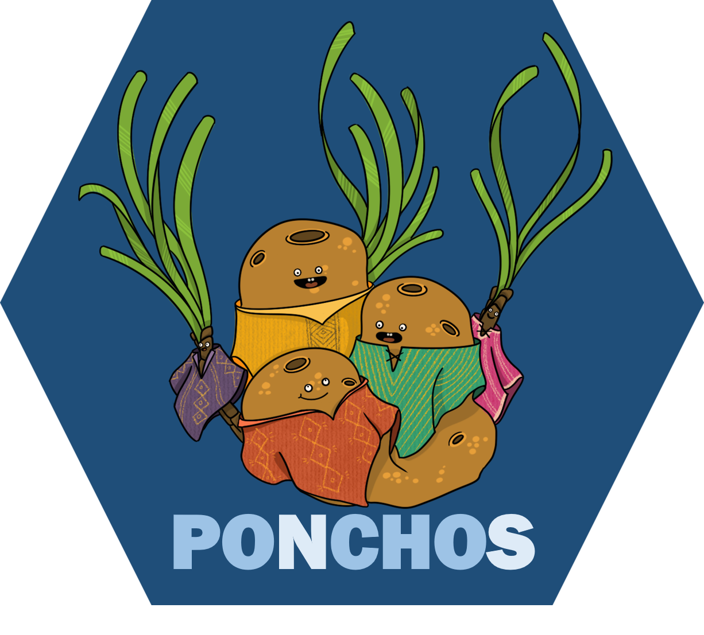

# POsidonia aNd CHOndrilla Symbiosis

This repository contains the data and code for our research article:

    Montilla et al. (202x). Oxygen and nutrient fluxes from a sponge-seagrass association in the Mediterranean Sea. Preprint.

Please cite this compendium as:

    Montilla LM, Berlinghof J, Guarcini E, Gallucci L, Furia M, Margiotta F, Meador T, Oliv� I, Fraschetti S, Zapata-Hern�ndez G, Cardini U. (202x). Research compendium for Oxygen and nutrient fluxes from a sponge-seagrass association in the Mediterranean Sea. Online at https://doi.org/10.5281/zenodo.10120398

How to download

You can download the compendium as a zip from from this URL: https://github.com/luismmontilla/ponchos/archive/master.zip
