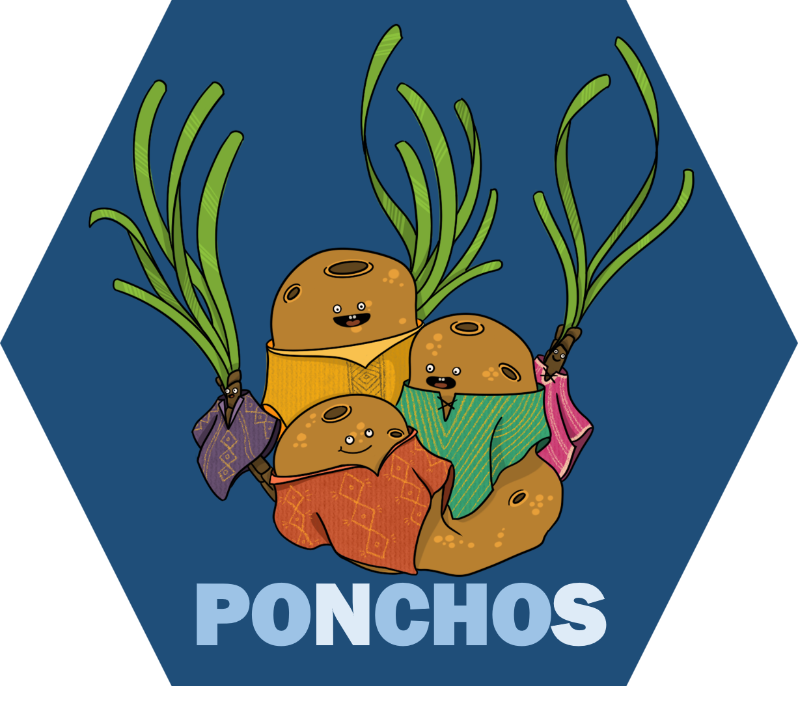

# POsidonia aNd CHOndrilla Symbiosis

## Complete Nitrogen cycling on seagrass leaves in a high-CO2 world 

This repository contains the data and code for our research article:

> Montilla et al. (202x). *title*. JOURNAL. DOI <DOI>

### How to cite

Please cite this compendium as:

> Montilla L, Guarcini E, Galluci L, Berlinghof J, Furia M, Meador T, Margiotta F, Fraschetti S, Olive I, & Cardini U. (202X)

Hex sticker by [Emy Miyazawa](https://orcid.org/0000-0002-7507-208X)
